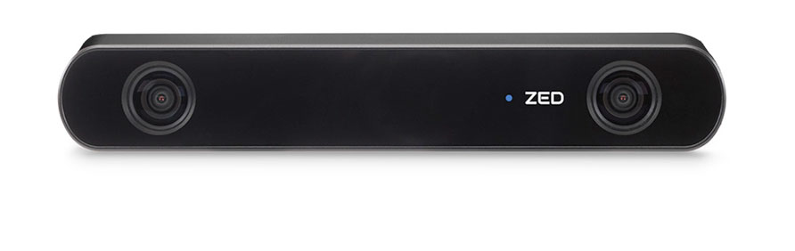

<h1> RoboCar</h1> 

<h3> Packages for pre-build </h3>

```bash
sudo apt-get install ros-melodic-octomap
sudo apt install tensorflow
sudo apt install opencv-python==4.1.1.26
sudo apt install lxml
sudo apt install tqdm
git clone https://github.com/FelipeVelazquez/RoboCar.git
```

<br> Add the workspace to the end of .bashrc file</br>
<h3>Hardware used</h3>
<ul>
	<li>RPLIDAR V2</li>
	 
	<li>Stereo Lab Camera ZED 2</li>
	
	<li>Mbed LPC1768 + Aplication board</li>
	
	<li>Nvidia Jetson nano</li>
	
</ul>
<h3> Commands to run the workspace </h3>

```bash
# Launch the rplidar node
roslaunch rplidar rplidar.lauch

#Launch the zed2 camera node (CUDA requiered)
roslaunch zed_wrapper zed2.launch

#Launch slam gmapping node
rosrun gmapping slam_gmapping

#Launch 3D Map using Octomap
roslaunch octomap_server octomap_mapping.launch

#Launch the AI part 1 Recolect data of zed2 camera
rosrun ia Data_recolect.py

#Launch the scan test (not complete yet...)
rosrun ia scan_test.py
```

<h3> Yolo V3 use TF2</h3>
<h4> All the credit of yolo implement use TF2.0 to <a href="https://github.com/zzh8829">Zihao Zhang</a> </h4>